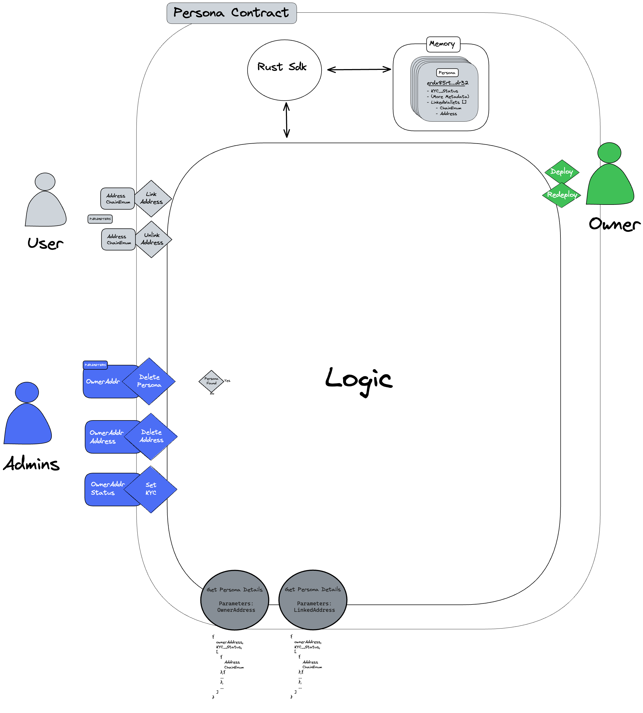

# Contribute to our Smart Contracts

Helio Connect is a decentralized application that uses smart contracts to store and manage Personas and their associated data. We have a collection a smart contracts to integrate multiple chains and cover a larger part of the web3.

