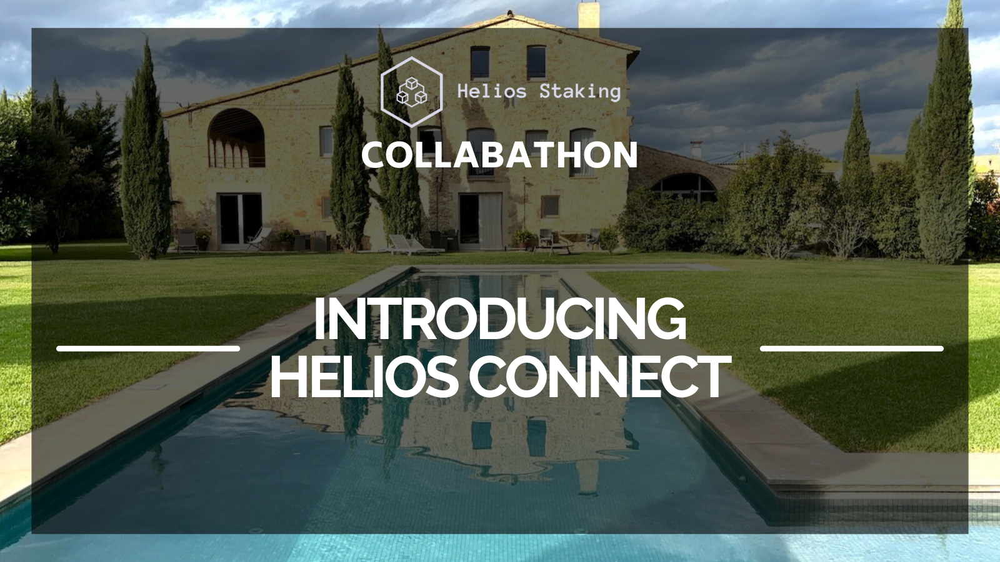
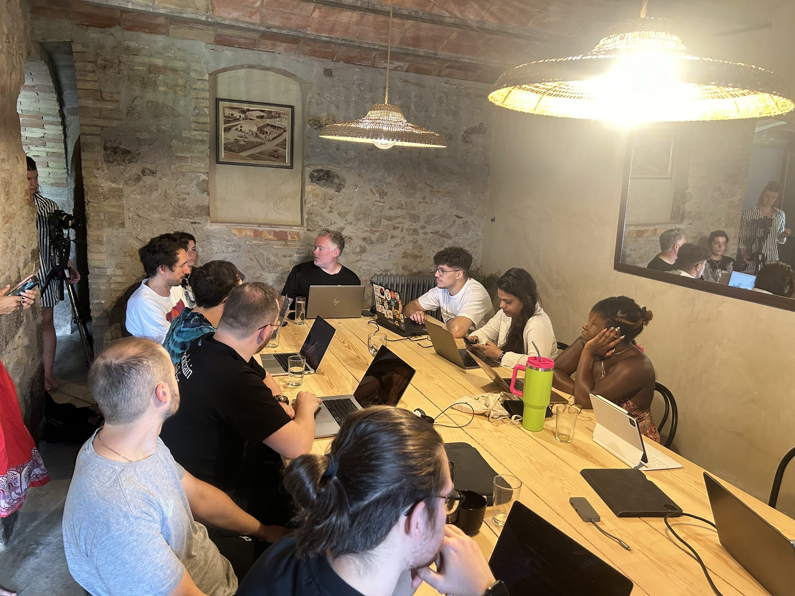

# Collabathon 2024: Introducing Helios Connect

The Helios Collabathon is not your typical hackathon. While hackathons traditionally focus on competition, the Helios Collabathon reimagines this format by emphasising collaboration. Set against the stunning backdrop of the Spanish Costa Brava, this 10-day event brings together some of the brightest minds in Web3 to work towards a common goal: building tools that will advance the ecosystem while fostering financial inclusion and innovation.

## Why We Are Building

At Helios Staking, our mission has always been to support innovation and promote financial inclusion. As staking providers on MultiversX and Injective, we understand the vital role that a nurturing environment plays in allowing new ideas to flourish. The Collabathon was born from this understanding. It is a unique opportunity to create something meaningful that can positively impact both Injective, MultiversX and the wider Web3 space.

Our goal is to put a spotlight on the people who make Web3 what it is: the builders. To achieve this, we’ve assembled a team of superstars from diverse backgrounds, with diverse specialties, all brought together to spend 10 days on an all-expenses-paid trip to the Costa Brava. Here, they will collaborate and build something extraordinary—together.

## What We Are Building

The centrepiece of the Collabathon is the creation of a cross-chain verification dApp called Helios Connect. This dApp will allow users to verify a singular identity across multiple wallets and ecosystems. Its potential use cases are vast, including applications in cross-chain integrations, decentralized autonomous organizations (DAOs), accounting, and more.

The first version of Helios Connect will focus on connecting wallets across the MultiversX and Injective ecosystems. However, our vision extends beyond these two chains. The dApp is designed to be flexible, with the potential to integrate additional chains in the future.

All the code for Helios Connect will be open source, allowing anyone to integrate and build on top of the foundation we’re creating. This is a critical aspect of our mission to foster innovation and give back to the community. By making our work accessible, we hope to inspire others to contribute to the ongoing evolution of Web3.

## How We Are Building

The Collabathon team has quickly found their rhythm. After an initial sync-up, everyone identified their roles and began working on their respective tasks. The development team, consisting of [Philippe](http://www.x.com/phybyte), [Patrick](http://www.x.com/0xdefser), [Micha](http://www.x.com/michavie_), [Davide](http://www.x.com/marinov_js), [Sonia](http://www.x.com/soniasinglas), and [Nicolae](http://www.x.com/mogagenicolae), has been hard at work on the back-end, front-end, and supporting documentation. Each member brings a unique set of skills to the table, and together they are making significant progress on the technical aspects of the project.

You can follow their progress through the [Helios Collabathon Github Organization](https://github.com/Helios-Collabathon)

Meanwhile, the creative team has been collaborating on how best to tell the story of both the event and the product. [Celia](http://www.x.com/celia_rules), our graphical expert, has designed a beautiful logo that captures the spirit of Helios Connect. [Helen](http://www.x.com/helenfemix) and [Tom](http://www.x.com/tomosrees2) have been busy crafting the narrative, using words, audio, and video to communicate the story of the Collabathon and the innovative product that is taking shape.

The whole event has been ably assisted by our hospitality experts Cara & Chelsea, who as well as supporting on the creative media efforts, have been crafting an incredible experience for all our participants in terms of food and other special touches that add an air of magic to this special event.

This blend of technical and creative talents is what makes the Collabathon so special. It’s not just about building a product—it’s about telling a story, one that highlights the power of collaboration in the Web3 space.

## Introducing Helios Connect

The culmination of our efforts is Helios Connect, a hub for connecting Web3 wallets across ecosystems to form a singular, provable identity. In an increasingly multi and cross-chain environment, the ability to verify user identities across different chains will become essential. Helios Connect will provide this functionality, helping projects verify the identity of their users across chains and borders.

Initially, users will be able to connect their MultiversX and Injective wallets under a singular identity. From there, we plan to expand the platform to support additional chains, making Helios Connect a versatile tool for both users and projects in the Web3 space.

This tool is about empowering Web3 users and products with tools that connect the growing web of technological advancements together more cohesively and efficiently. As the Web3 ecosystem grows, so too does the need for tools that can bridge different chains and platforms. Helios Connect is our contribution to this evolving landscape, and we are excited to see how it will help advance the growth of Injective, MultiversX, and Web3 as a whole.

The dApp is live on devnet and will update as development continues 💪

## The road ahead

The Collabathon is just the beginning. Over the next 10 days, our team will continue to work tirelessly to bring Helios Connect to life. But our vision extends beyond this. We see Helios Connect as a foundational tool that will continue to evolve and expand long after the event is over.

Through Helios Connect we are building bridges between ecosystems, fostering an ethos of interoperability and connectivity that will advance development and amplify the impact of blockchain and Web3 at large.

By making our code open source, we hope to inspire other developers to build on our work and create new applications that push the boundaries of what is possible in Web3. This spirit of collaboration is at the heart of the Collabathon, and we believe it will be the key to unlocking the full potential of Web3.

Building better, together 🛠️
